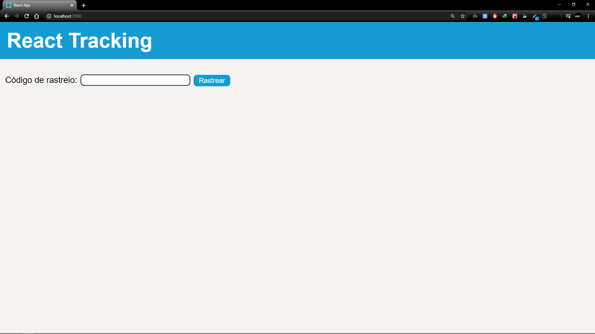
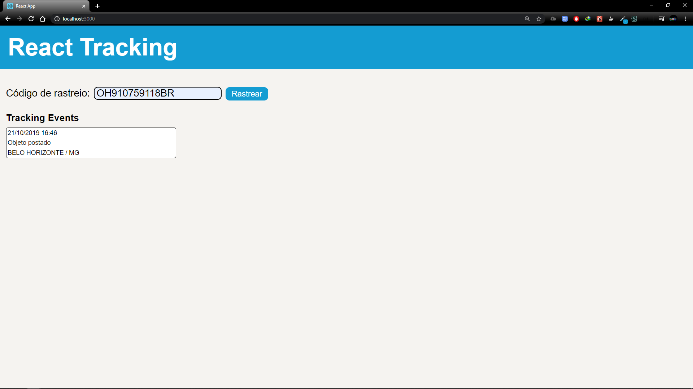

# React-Tracker
Rastreador dos correios com React e Node
###### totalmente responsivo



## Para utilzar:

##### certifique-se de não estar usando as portas 3000 e 3333

1. Entre na pasta api e rode ```yarn install```, quando terminar o download rode ```yarn dev```
2. Entre na pasta web e rode ```yarn install```, quando terminar o download rode ```yarn start```
3. Na aba do navegador que o ```yarn start``` irá abrir, insira um código de rastreio válido e clique no botão "Rastrear".  

###### obs: Por causa da api usada, ele só exibe a data, hora e o local de onde ele foi postado.
